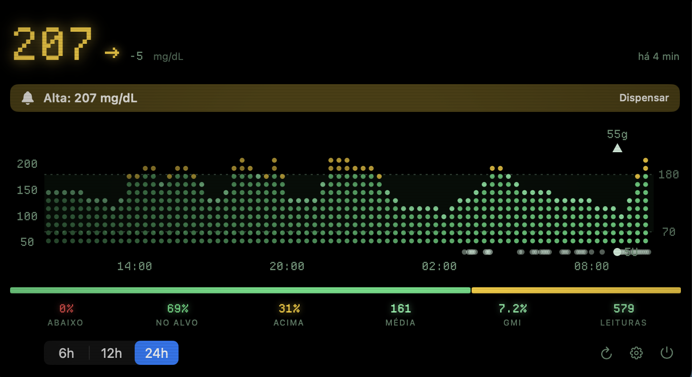
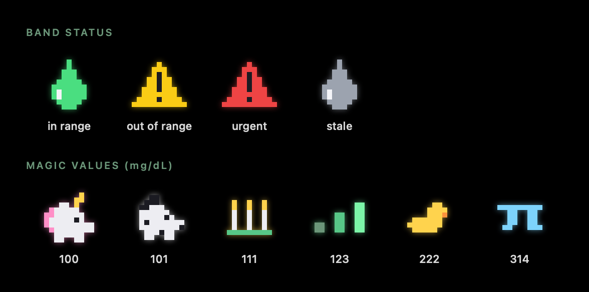

# Macscout

**[English](README.md)** · **Português (Brasil)**

<p align="center">
  
</p>

<p align="center">
  
</p>

<p align="center">
  <b>Seu Nightscout, no notch.</b><br>
  Glicemia ao vivo do seu site <a href="https://nightscout.github.io/">Nightscout</a> no topo da tela —
  uma olhada e pronto, zero interrupções.
</p>

<p align="center">
  macOS 14+ · Swift 6 · zero dependências · English / Português (BR) · MIT · <b>#WeAreNotWaiting</b>
</p>

## Instalação

**[⬇ Baixe o DMG mais recente](https://github.com/thiagomsoares/macscout/releases/latest)** (v0.1.0)

1. Abra o DMG e arraste o **Macscout** para **Aplicativos**.
2. **Primeira abertura:** as releases ainda não são notarizadas pela Apple (assinatura com
   Developer ID está no roadmap), então o macOS vai bloquear a primeira execução. Vá em
   **Ajustes do Sistema → Privacidade e Segurança**, role até o final e clique em
   **"Abrir Mesmo Assim"**, depois confirme. Isso é feito uma única vez.
3. O Macscout é um app de barra de menus: sem ícone no Dock. Ele vive no notch (ou numa
   pílula flutuante em Macs sem notch) e na barra de menus. Deixe o ponteiro sobre o notch
   para expandir o painel.

## Recursos

- **Glicemia ao vivo no notch** — uma pílula preta que se funde ao notch do MacBook mostrando o valor, a seta de tendência e o delta em tipografia pixel nítida (Departure Mono), com as cores do Nightscout (verde no alvo, amarelo alto, vermelho baixo, cinza desatualizado). Em Macs sem notch, flutua logo abaixo da barra de menus.
- **Interação nativa do notch** — deixe o ponteiro sobre a pílula e ela se abre com mola (0,12 s de espera na entrada, 0,35 s de tolerância na saída); clique para fixar aberta. Expandir/recolher usa um animador de mola de verdade (expansão 0.40/0.70, recolhimento 0.34/0.85 — ajustados à mão). Hit-test pela silhueta mantém os cantos vazios e a área da câmera click-through para a barra de menus; o primeiro clique conta sem roubar o foco; botão direito na banda abre Painel / Atualizar / Ajustes… / Encerrar. Continua visível sobre apps em tela cheia.
- **Painel completo** — gráfico de glicemia dot-matrix verde-fósforo (Canvas puro) com faixa do alvo, pontos fora do alvo em amarelo/vermelho, trilha de insulina ponderada por dose, marcadores de carboidrato e tooltips; estatísticas de tempo no alvo, média e GMI em 6 / 12 / 24 h.
- **Leitura na barra de menus** — `118 ↗` na cor nativa do sistema, com tooltip mostrando a idade do dado e ações rápidas (Abrir Painel, Atualizar, Ajustes…, Encerrar).
- **Alertas configuráveis** — limites de muito baixa / baixa / alta / muito alta, alertas de subida/queda rápida, alerta de dados desatualizados, som por categoria, intervalos de repetição, horário silencioso (silencia apenas os sons) e expansão automática opcional do painel em alertas urgentes.
- **Som 8-bit sintetizado** — cada aviso sonoro e o jingle da cerimônia de introdução são chiptunes gerados em código (ondas quadradas/triangulares, zero arquivos de áudio). Sons clássicos do sistema continuam disponíveis por categoria.
- **Uma introdução de verdade** — cinco atos curtos sobre um fundo de raios sintetizado: dados demo ao vivo no notch enquanto você lê, um teste de conexão que mostra a sua leitura real dentro do card, padrões de alerta recomendados e uma cerimônia de encerramento (confete + jingle + quique da pílula).
- **Modo demo** — dados de CGM sintéticos para experimentar o app sem um site Nightscout.
- **Nativo e sem dependências** — SwiftUI / AppKit puros. Nenhum pacote de terceiros.

O design system (tokens de cor, tipografia, especificações de movimento e som) está em [docs/DESIGN.md](docs/DESIGN.md).

## Requisitos

- macOS 14 ou mais recente
- Para compilar do código-fonte: toolchain Swift 6.2+ (as Xcode Command Line Tools bastam — o Xcode completo **não** é necessário)

## Compilar

```sh
swift build -c release --product Macscout    # compila o binário
scripts/build.sh                              # compila + monta dist/Macscout.app (assinatura ad-hoc)
swift test                                    # roda a suíte de testes
```

O `scripts/build.sh` tenta primeiro um build universal (arm64 + x86_64) e cai para o build da sua arquitetura se necessário, depois monta o `dist/Macscout.app` e assina ad-hoc (`codesign --sign -`).

O ícone do app é gerado programaticamente:

```sh
swift scripts/make-icon.swift   # regenera Sources/Macscout/Resources/AppIcon.icns
```

## Executar

```sh
open "dist/Macscout.app"
```

O Macscout é um app de barra de menus (`LSUIElement`): sem ícone no Dock. Ele vive na área do notch e na barra de menus. Na primeira execução, inicia em **modo demo** até você informar a URL do seu Nightscout nos Ajustes.

## Configuração

Abra **Ajustes…** pelo item da barra de menus ou pelo painel.

### Geral

- **URL do Nightscout** — ex.: `https://seusite.exemplo.com` (apenas http/https).
- **Token** — um token de acesso do Nightscout (Admin → Subjects). Enviado como parâmetro `token`. Tem precedência sobre o API secret quando os dois estão definidos.
- **API secret** — o seu `API_SECRET`; enviado como header `API-SECRET: sha1(secret)`. Guardado no Keychain do macOS, nunca em texto puro.
- **Testar Conexão** — chama `/api/v1/status.json` e mostra o resultado.
- **Unidades** — mg/dL ou mmol/L.
- **Intervalo de atualização** — 30 s, 1, 2 ou 5 min.
- **Janela padrão do gráfico** — 6 / 12 / 24 h.
- **Abrir ao iniciar sessão**, **mostrar ícone na barra de menus**, **modo demo**.

### Alertas

Por categoria (muito baixa, baixa, alta, muito alta, subida rápida, queda rápida, dados desatualizados): liga/desliga, limite (na unidade selecionada), som, além de repetição global (padrão 20 min; 10 min para urgentes), horário silencioso, volume e prévia dos alertas.

## Arquitetura

```
Package.swift
Sources/
  MacscoutCore/        lógica testável, sem UI
    Models.swift           GlucoseEntry, Treatment, DeviceStatus, TrendArrow, GlucoseUnit
    NightscoutClient.swift cliente REST assíncrono (auth por token ou api-secret, erros tipados)
    AlertEngine.swift      avaliação de limites, repetição/dedup, horário silencioso
    AlertSettings.swift    configuração de alertas Codable (limites em mg/dL)
    StatsCalculator.swift  tempo no alvo, média, GMI
    UnitConverter.swift    mg/dL ↔ mmol/L
    Chiptune.swift         síntese dos avisos chiptune + jingle da cerimônia (pura, testada)
  Macscout/            o app (SwiftUI + AppKit)
    App/ (main, AppDelegate, AppState, SettingsStore, AlertNotifier, L10n)
    Windows/ (NotchWindowController, MenuBarController, SpringFrameAnimator)
    Audio/ (SoundPlayer, ChiptunePlayer — toca os avisos gerados pelo MacscoutCore)
    Views/ (tokens de design + fonte pixel, NotchView, SparklineView, ExpandedPanelView,
            GlucoseChartView, StatsView, PixelIcons, SettingsView)
    Onboarding/ (OnboardingWindowController, OnboardingView, ConfettiView)
    Resources/ (Info.plist, AppIcon.icns — gerado, Fonts/DepartureMono + OFL.txt, pt-BR.lproj)
  MacscoutCoreTestsRunner/  pequeno executável auxiliar do harness de testes
Tests/MacscoutCoreTests/
scripts/build.sh, scripts/make-icon.swift, scripts/release.sh
```

### Uma nota sobre o harness de testes

Este projeto compila **apenas com as Command Line Tools** (sem Xcode). Essa toolchain não traz o XCTest nem um runner funcional do swift-testing, então o `Tests/MacscoutCoreTests/TestHarness.swift` implementa um pequeno harness de asserções que executa quando o SwiftPM carrega o bundle de testes e faz o `swift test` falhar com código de saída diferente de zero em qualquer verificação reprovada. Os testes de cliente baseados em URLSession rodam em um processo filho (`MacscoutCoreTestsRunner`, disparado pelo harness) porque o CFNetwork não consegue inicializar dentro de um construtor de `dlopen`.

## Roadmap

- [ ] Overlays de dados de Loop / bomba
- [ ] Complicação para o Watch
- [ ] Múltiplos perfis de Nightscout
- [ ] Suporte a Widget / StandBy
- [ ] Releases assinadas e notarizadas

## A parte divertida

A banda carrega um ícone pixel desenhado em código ao lado da leitura. Uma gota de
sangue pulsante significa que você está no alvo; ela vira uma placa de atenção
amarela quando você sai do alvo e vermelha quando a coisa fica urgente. E em
números mágicos — uma tradição da comunidade do diabetes — o ícone vira uma
pequena celebração: bata 100 mg/dL e um unicórnio aparece.

<p align="center">
  
</p>

## Dedicatória

Dedicado à **comunidade AndroidAPS** e ao meu filho, **George Benício Soares**. ❤️

Com orgulho de fazer parte do movimento **#WeAreNotWaiting** — a comunidade DIY do
diabetes (Nightscout, AndroidAPS, Loop, OpenAPS) que constrói as ferramentas de
que precisamos em vez de esperar por elas.

## Autor

Criado por **Thiago Mota Soares** — se o Macscout te ajuda, uma ⭐ no GitHub e um
follow no Instagram ([@paipancreas](https://instagram.com/paipancreas)) fazem meu dia!

## Agradecimentos

- [Departure Mono](https://departuremono.com/) de Helena Zhang, incluída sob a SIL Open Font License 1.1 (veja `Sources/Macscout/Resources/Fonts/OFL.txt`).
- [Nightscout](https://nightscout.github.io/) — o Macscout é um cliente independente e não é afiliado ao projeto Nightscout.

## Licença

[MIT](LICENSE) © [Thiago Mota Soares](https://github.com/thiagomsoares) e colaboradores do Macscout
